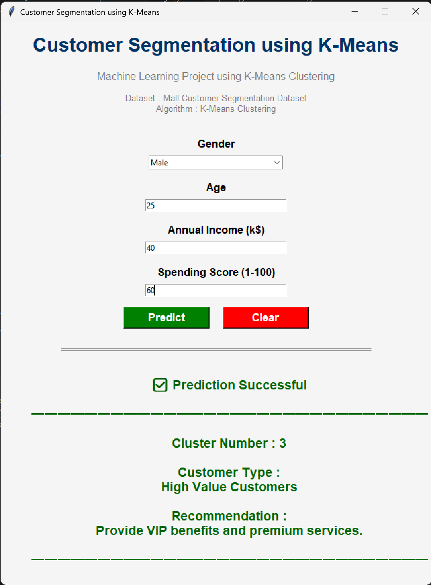
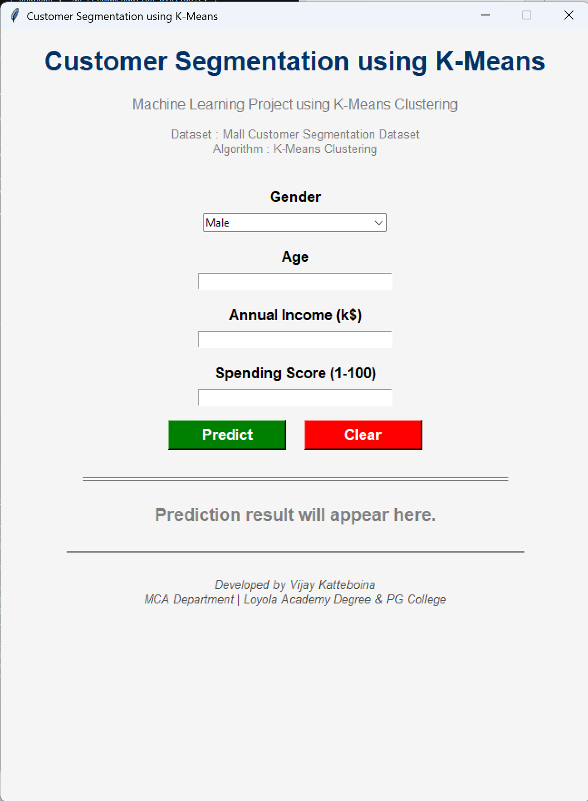
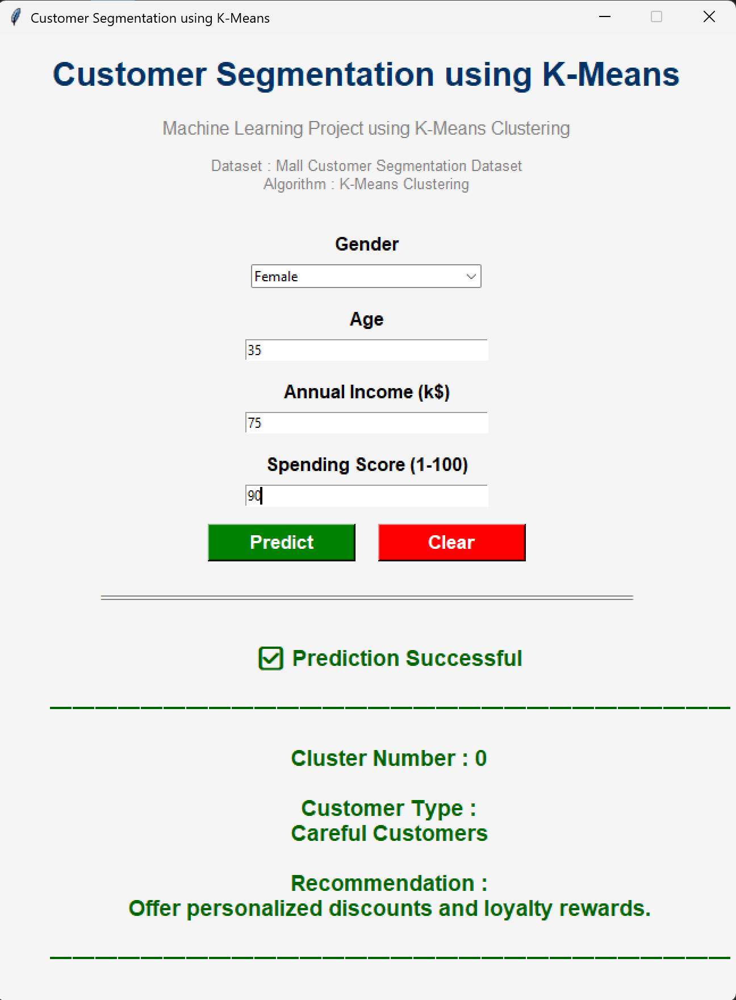
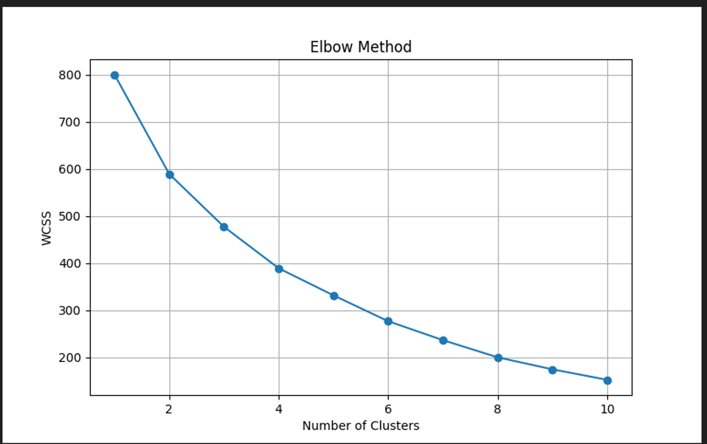
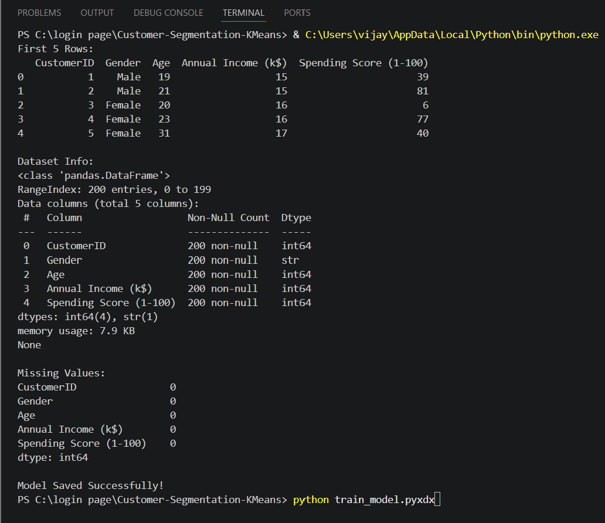
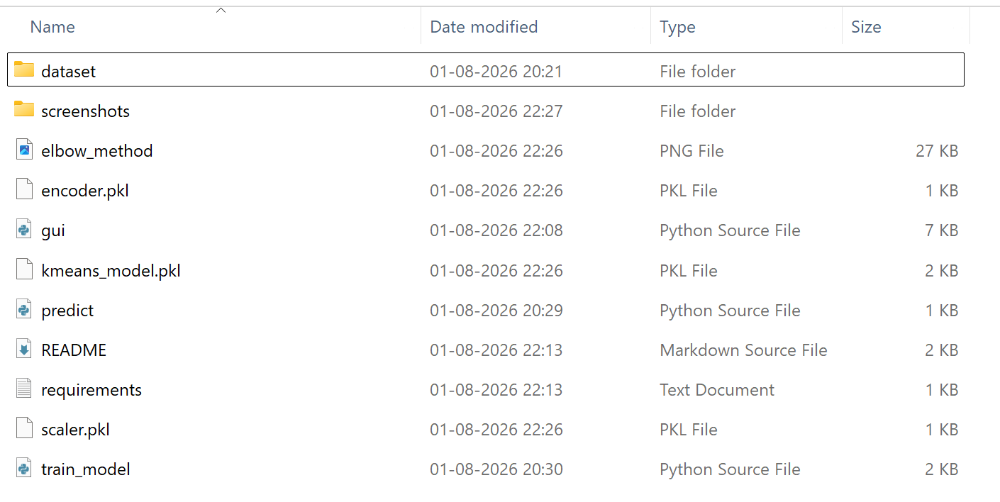

# Customer Segmentation using K-Means Clustering

A Machine Learning desktop application developed using **Python**, **Scikit-learn**, and **Tkinter** to perform customer segmentation using the **K-Means Clustering** algorithm.

---
# Project Preview
## GUI



---
# Project Objective

The objective of this project is to segment mall customers into different groups based on their purchasing behavior using the K-Means Clustering algorithm.

The segmentation is performed using the following customer attributes:

- Gender
- Age
- Annual Income (k$)
- Spending Score (1–100)

---
# Dataset

**Dataset Name:**

Mall Customer Segmentation Dataset

**Source:**

https://www.kaggle.com/datasets/vjchoudhary7/customer-segmentation-tutorial-in-python

---
# Algorithm Used

- K-Means Clustering

---
# Technologies Used

- Python
- Tkinter
- Pandas
- NumPy
- Matplotlib
- Scikit-learn
- Joblib

---
# Project Features

- Customer Data Cleaning
- Missing Value Checking
- Gender Encoding
- Feature Scaling
- Elbow Method
- K-Means Clustering
- Trained Model Saving (.pkl)
- Tkinter GUI
- Customer Cluster Prediction
- Customer Recommendation System

---
# Project Structure

```text
Customer-Segmentation-KMeans/
│
├── dataset/
│   └── Mall_Customers.csv
│
├── screenshots/
│   ├── gui_before.png
│   ├── gui_after.png
│   ├── gui_prediction2.png
│   ├── elbow_method.png
│   ├── terminal_output.png
│   └── project_structure.png
│
├── gui.py
├── predict.py
├── train_model.py
│
├── kmeans_model.pkl
├── scaler.pkl
├── encoder.pkl
│
├── README.md
└── requirements.txt
```

---
# Installation

Clone the repository

```bash
git clone <repository-url>
```

Move into the project folder

```bash
cd Customer-Segmentation-KMeans
```

Install dependencies

```bash
pip install -r requirements.txt
```

---
# Run the Project

Train the model

```bash
python train_model.py
```

Run the GUI

```bash
python gui.py
```

---
# Output Screenshots
## GUI Before Prediction



---
## GUI After Prediction


---
## Another Prediction



---
## Elbow Method



---
## Terminal Output



---
## Project Structure



---
# Future Improvements

- Add more customer attributes
- Improve GUI design
- Export prediction results
- Support multiple clustering algorithms

---
# Author

**Vijay Katteboina**

Master of Computer Applications (MCA)
Loyola Academy Degree & PG College

---
## Thank You